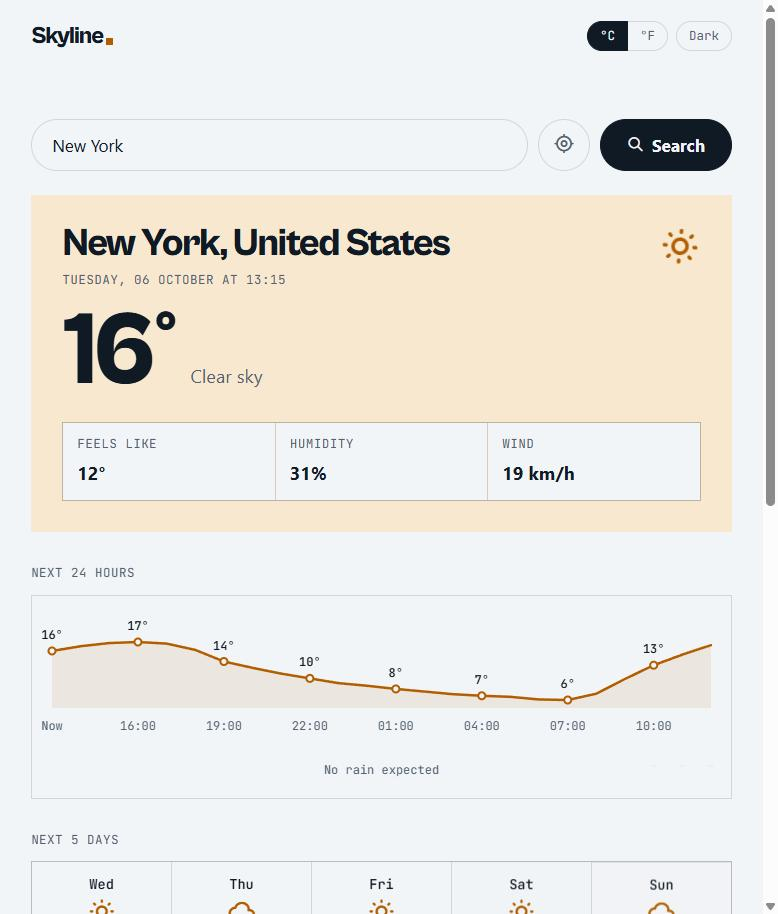

# Skyline Weather

Search any city for its current weather, the next 24 hours, a five-day forecast and how good the day is for a run.

**Live demo:** https://tahir-ismail.github.io/skyline-weather/



## Features

- City search with **suggestions as you type** (so you can pick *which* Springfield), or **use my location**; opens on your last place (or Cape Town on a first visit)
- Live conditions: temperature, feels like, humidity and wind
- **Colours that follow the weather:** sunny, cloudy, rain, storm, snow, fog and night each have their own scheme
- **Next 24 hours** chart: temperature line with rain-chance bars
- Five-day forecast with highs, lows and rain chance
- **Today** cards: sunrise/sunset arc, running conditions score, UV index, air quality and rain today
- °C/°F switch (wind changes between km/h and mph with it)
- Light and dark mode
- **Installable** on phones and desktop, and opens **offline** with the last forecast
- Remembers your last place, unit and theme between visits
- Clear messages when a city isn't found, location is blocked or you're offline
- Loading skeleton, staggered entrance and gentle icon motion (all reduced for `prefers-reduced-motion`)
- Works on phones: the forecast row scrolls sideways instead of squashing

## Built with

- HTML, CSS and plain JavaScript (no frameworks or build step)
- [Open-Meteo](https://open-meteo.com/) Geocoding, Forecast and Air Quality APIs
- [BigDataCloud](https://www.bigdatacloud.com/) reverse geocoding (only when you press "use my location")
- Hand-built SVG for the chart and sun arc (no chart library)
- Service worker and web app manifest for install and offline
- Node's built-in test runner for unit tests
- [Tabler Icons](https://tabler.io/icons)
- Hosted on GitHub Pages

## How it works

1. The search form sends the city name to the **Geocoding API**, which returns its coordinates.
   "Use my location" gets coordinates from the browser instead, and BigDataCloud names the place.
2. The **Forecast** and **Air Quality** APIs are called at the same time with `Promise.all`. They return current, hourly and daily data in the place's own time zone.
3. Both responses are stored in one `state` object, and `render()` draws the page from it.
4. The running score starts at 100 and subtracts points for feels-like temperature outside 8–20°C, rain, wind, UV and air quality. Thunderstorms always score "Poor".

## Project structure

```
index.html            Page structure
style.css             Styles, weather colour schemes and animations
app.js                Fetching, state, rendering and events (talks to the page)
logic.js              Pure logic: scores, levels, formatting (no page, no network)
sw.js                 Service worker: offline cache
manifest.webmanifest  Name, icons and colours for the installed app
tests/logic.test.js   Unit tests for logic.js
```

## Design decisions

- **Plain JavaScript:** no framework, so every part of the fetch-and-render flow is visible and easy to explain.
- **Open-Meteo:** free with no API key, so there's no secret to protect in a public repo.
- **Convert units on screen:** data is always fetched in Celsius and converted for display. Switching °C/°F is instant and doesn't need another request.
- **One source of truth:** the screen is always drawn from `state`, so a unit change just calls `render()` again and nothing gets out of sync.
- **Errors replace old results:** a failed search hides the previous city's weather so it can't be mistaken for the new one.
- **Safe storage:** `localStorage` calls are wrapped in `try/catch`, so the app still works if the browser blocks storage (for example in private mode).
- **Air quality can fail without breaking the page:** it's extra information, so `getAirQuality()` returns `null` on errors and the cards say "No data" instead of the whole search failing.
- **Only show data that works everywhere:** a pollen card was tried, but Open-Meteo only has pollen for Europe, so most visitors saw "No data". It was swapped for a rain card that works worldwide.
- **Charts drawn by hand in SVG:** a library would be bigger than the whole app. The chart is redrawn on resize so labels never squash on phones.
- **Logic split from the page:** everything that just turns data into answers (running score, UV and AQI levels, sun position, unit conversion) lives in `logic.js` with no DOM or network code. That's what makes it testable.
- **Suggestions that don't spam the API:** typing waits 250ms after the last key (debouncing), and an `AbortController` cancels an older request if a newer one starts, so results never arrive out of order.
- **Network first, cache as backup:** the service worker always tries for fresh data and only uses the saved copy when offline, so visitors never get stuck on an old version of the app.
- **Install without an app store:** a web app manifest and service worker make it installable for free, without the $99/year Apple or $25 Google developer fees.
- **Accessible by default:** a real `<form>` (Enter works), the ARIA combobox pattern for suggestions (arrow keys, Enter, Escape), `aria-live` status messages, `aria-pressed` toggle buttons and screen-reader labels for weather icons.

## Run it locally

No install needed. Serve the folder with any static server (ES modules and service workers don't run from `file://`), for example:

```bash
npx serve .
```

## Tests

31 unit tests cover the running score, UV and air-quality bands, rain advice, sun position, unit conversion and HTML escaping. Run them with Node 18+:

```bash
npm test
```

## Author

Tahir Ismail, [portfolio](https://tahir-ismail.github.io/) · [GitHub](https://github.com/tahir-ismail)
